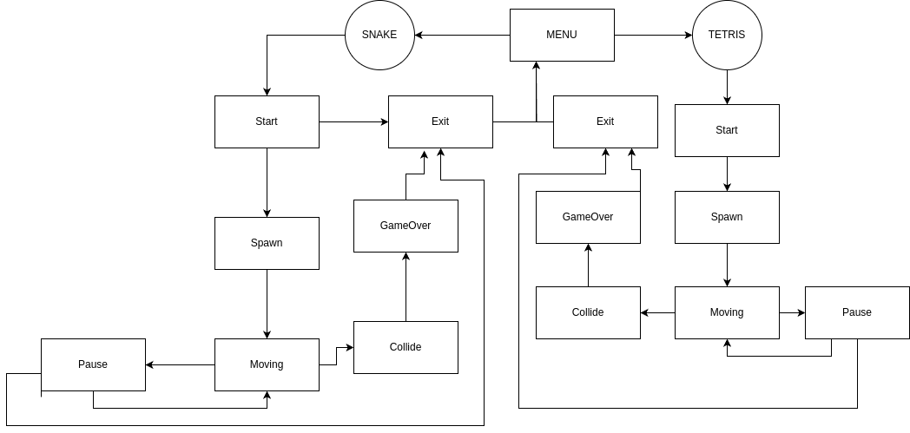

# BrickGame v2.0

BrickGame v2.0 - это дополненная реализация набора классических игр, в предущем проекте была реализована игра тетрис, в этот раз набор игры пополнился игрой змейка, написанной на С++.

## Требования

- Операционная система: Linux или macOS
- Компилятор, поддерживающий 17 стандарт языка С++
- Для отображения терминального интерфейса используется библиотека ncurses
- Для графичческого интерфейса desktop-приложения используется framework Qt6.
- googletest для unit-тестов

## Структура проекта

- `src/brick_game/snake` - код библиотеки с логикой игры змейка
- `src/brick_game/tetris` - код библиотеки с логикой игры тетрис
- `src/controller` - код контроллеров
- `src/gui/cli` - код терминального интерфейса 
- `src/gui/desktop` - код графического интерфейса
- `src/tests` - unit-тесты для библиотек (GTest)
- `src/Makefile` - файл для сборки проекта
- `Dockerfile` - для провередения тестов с использованием valgrind 

## Использование


Запустите игру:
```bash
make install
make run_cli // Запуск консольной версии игры
make run_desktop // Запуск десктопной версии игры
```

#### Игровой процесс

### Змейка
- Змейка передвигается по полю самостоятельно, на один блок вперед по истечении игрового таймера.
- Когда змейка сталкивается с «яблоком», ее длина увеличивается на один.
- Когда длина змейки достигает 200 единиц, игра заканчивается победой.
- Когда змейка сталкивается с границей поля или сама с собой, игра заканчивается поражением.
- Пользователь может менять направление движение змейки с помощью стрелок, при этом змейка может поворачивать только налево и направо относительно текущего направления движения.
- Пользователь может ускорять движение змейки зажатием стрелки по направлению движения змейки.

#### Управление

- Пробел - Начало игры
- Пробел / Tab - Поставить игру на паузу / продолжить игру
- Esc - Завершение игры
- Стрелка влево — движение змейки влево
- Стрелка вправо — движение змейки вправо
- Стрелка вниз — движение змейки вниз
- Стрелка вверх — движение змейки вверх

### Тетрис

#### Управление

- Пробел - Начало игры
- Tab - Поставить игру на паузу / продолжить игру
- Esc - Завершение игры
- Стрелка влево — движение тетромино влево
- Стрелка вправо — движение тетромино вправо
- Стрелка вниз — ускорение движения тетромино вниз
- Стрелка вверх — вращение тетромино
- Пробел - падение тетромино

## Дополнительные механики

### Подсчет очков и рекорд

- Подсчет очков
- Хранение максимального количества очков в файле
- Начисление очков:
    - Змейка: при поедании очередного «яблока» добавляется одно очко
    - Тетрис:
        - 1 линия — 100 очков
        - 2 линии — 300 очков
        - 3 линии — 700 очков
        - 4 линии — 1500 очков

### Механика уровней

- Механика уровней
- Каждый раз, когда игрок набирает определенное количество очков, уровень увеличивается на 1
    - Змейка: каждые 5 очков
    - Тетрис: каждые 600 очков
- Повышение уровня увеличивает скорость движения змейки или фигур
- Максимальное количество уровней — 10

## Тестирование

Библиотеки, реализующие логику игр, покрыты unit-тестами с использованием библиотеки gtest. Покрытие библиотек тестами составляет не меньше 80 процентов.

Запустите тесты на своей машине:
```bash
make tests
```

Запустите тесты в докер-контейнере:
```bash
docker build -t brick_tests .
docker run brick_tests
```


## Диаграмма конечного автомата



